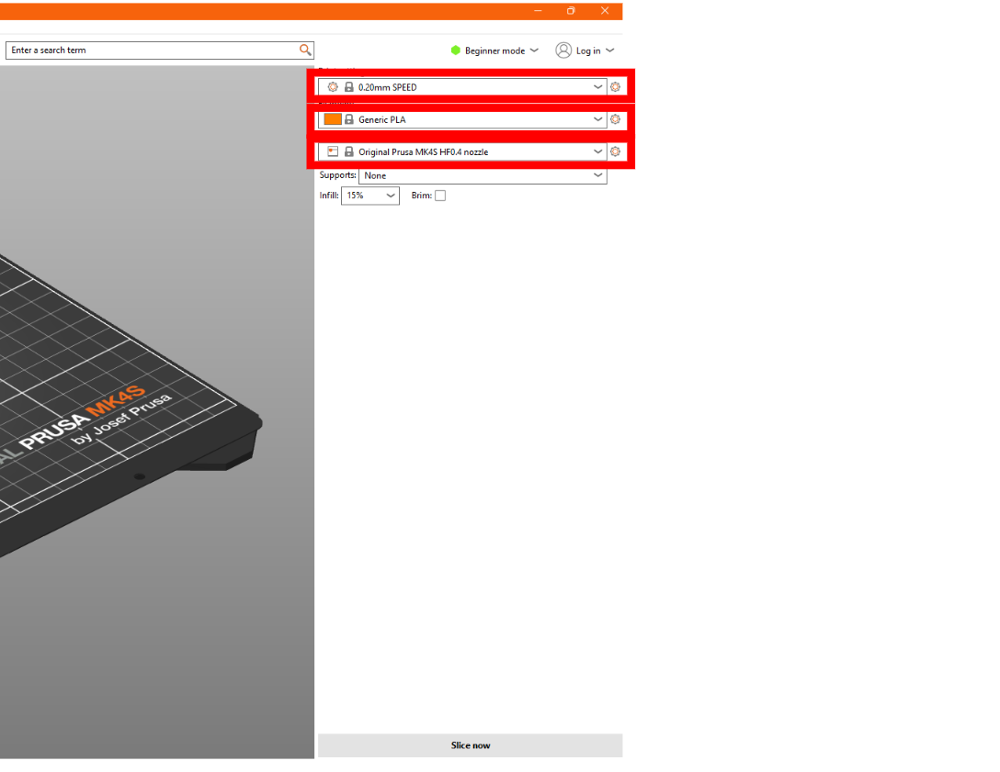

# Prusa Slicer

**Links**

* [Prusa Slicer Download - The Slicer](https://www.prusa3d.com/page/prusaslicer_424/)
* [Printables - For 3d Models](https://www.printables.com/)
* [Filament Material Guide from Prusa](https://help.prusa3d.com/filament-material-guide)

# FDM 3D Printing

FDM 3D printers work by squeezing filament out of a nozzle attached to a heater, drawing lines across a print bed 
and moving upwards ever so slightly to generate your part from the bottom up.

*Image: https://giphy.com/gifs/banggood-diy-3d-printing-creality-j3K5Hk9WmCyk7ziG9Z*

A consequence is that somehow, you must take your 3D model (typically a .STL) and translate it into movements
for each motor on the 3d-printer. Going through and doing this manually is [completely possible by writing in G-code](https://help.prusa3d.com/article/prusa-firmware-specific-g-code-commands_112173), but not at all
efficient. This is why *slicers* exist.

# What is a "Slicer" and Why you Need it

A *slicer* is a program that allows you to put a 3D model into it, and the slicer will then go, layer by layer, and 
figure out the best path for the printer nozzle to take in order to print your part. The slicer will then take that
information and generate G-code which your printer will read as it is printing to tell the nozzle and bed where to go,
and how hot to get. 

Different 3D printers use different slicers. For instance:

* All of Prusa's printers use [Prusa Slicer](https://www.prusa3d.com/page/prusaslicer_424/) (what is covered in this article)
* Bambu Lab printers use [Bambu Studio](https://bambulab.com/en-us/download)
* Lots of other printers use [Cura](https://ultimaker.com/software/ultimaker-cura/) as a slicer, like the Ender series. 
* Many more...

For the purposes of this tutorial, we will be installing and setting up
[Prusa Slicer](https://www.prusa3d.com/page/prusaslicer_424/) for the
[Prusa Mk4s](https://www.prusa3d.com/product/original-prusa-mk4s-3d-printer-kit/)
3D printers with an MMU3 on one. The MMU3 is Prusa's answer to multi-material printing
(hence, the Multi-Material-Unit, or MMU). The MMU allows the printers to change
filaments on-the-go during printing. 

# How to set up your Slicer

Before anything, you will need a 3D printer to print with, this tutorial is using the [Prusa Mk4s](https://www.prusa3d.com/product/original-prusa-mk4s-3d-printer-kit/).

First, [download the slicer](https://www.prusa3d.com/page/prusaslicer_424/) for your operating system.

Click the installer in your downloads in your browser. It should pop up when the slicer installer finished downloading. 
If the installer doesn't pop up, check your local downloads folder using your file explorer.

Run the installer by clicking it. Leave the Default settings on the next few
screens and click "next". Then, click "install" when prompted, you can check the
box if you want to create a desktop shortcut or not. 

When the installer is finished, you should see this screen. Go ahead and leave 
"Launch PrusaSlicer" checked so we can configure the slicer itself.

The Installer should start and present you with this screen:

You'll want to go to the top menu and click: **Configuration -> Configuration Wizard**
which should present you with this screen:

Click on **Prusa Research** on the left:

Then scroll down to the **MK4 Family** header and check the boxes:

* Under "Original Prusa MK4S" -> **HF0.4 mm nozzle**
* Under "Original Prusa MK4S MMU3" -> **0.4 mm nozzle**

This will install printer presets to Prusa slicer. Printer presets are just a 
collection of settings for any given printer. Instead of defining them ourselves, 
Prusa gives them to us through this configuration wizard.

Just click **Finish** in the bottom right to wrap everything up. You should now
be able to select the two profiles on the right of your screen under **Printer:**.

# What to Print?

Now that you have a slicer, you just need a 3D model! You can make your own with
a tool like [OnShape](https://www.onshape.com/en/), or go to
[Printables.com](https://www.printables.com) to fetch a print. We will go through
getting a print through Printables to put onto the printer.

First, we'll find a model, like [this one](https://www.printables.com/model/436740-prusa-keychain-sample-model) from Prusa Research. There is actually a super easy way to print models from Printables.com. Click "Files" and scroll down to "Model Files".

Then, click on "Slice" and both Printables.com and your browser will ask you to open Prusa Slicer, go ahead and click "allow" or "ok" through these dialogs. This should open PrusaSlicer. **Make sure to import models only** when prompted.

The model should now be present in your slicer, the last step until we are ready to slice is to make sure your settings match:

Now, click "Slice" in the bottom right corner of PrusaSlicer and your model should now change to look like this:

Then, grab the USB drive that came with your printer and put it in your computer, click the "Export G-code" button in the corner, save the file to your USB drive, and print it! We'll let you figure that one out, as it is out of scope for this tutorial.